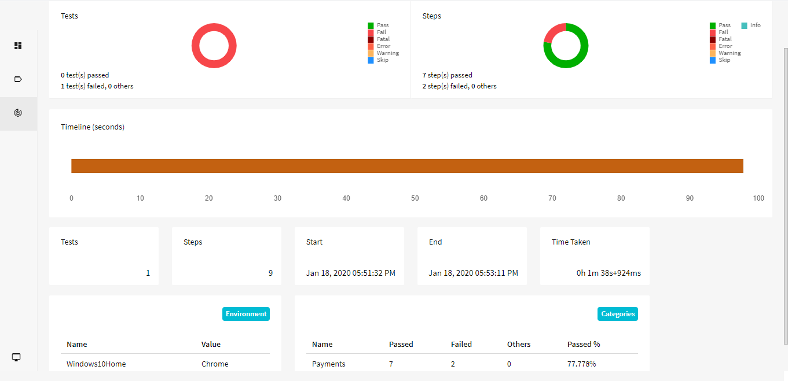

## REST-ASSURED
[](https://maven-badges.herokuapp.com/maven-central/io.rest-assured/rest-assured)
[](http://www.javadoc.io/doc/io.rest-assured/rest-assured)


Testing and validation of REST services in Java is harder than in dynamic languages 
such as Ruby and Groovy. REST Assured brings the simplicity of using these 
languages into the Java domain.


## Examples
Here's an example of how to make a GET request and validate the JSON response using above Project:

```java
RestAssured.baseURI=BaseclassInitilizer.excelHashMapValues.get(url);
BaseclassInitilizer.httpreq=RestAssured.given().filter(new RequestLoggingFilter(BaseclassInitilizer.requestcapture)).filter(new ResponseLoggingFilter(BaseclassInitilizer.responsecapture));
BaseclassInitilizer.response =BaseclassInitilizer.httpreq.get(BaseclassInitilizer.excelHashMapValues.get("serviceBaseURI"));

//The below Verify_JSON_Data is used to check the JSON Mandatory fields are present or Not.
Common_Methods.Get_Instance().Verify_JSON_Data(Common_Methods.getResponse_content(), data);
```

Using parameters:

```java
given().
    param("key1", "value1").
    param("key2", "value2").
when().
    post("/somewhere").
then().
    body(containsString("OK"));
```

Need to Read JSON ? Here is the below Solution:

```java
 //Below is sample snippet to Read JSON
 JSONObject obj = new JSONObject(Response); 
		   Iterator<String> keyset = obj.keys(); 

			while (keyset.hasNext())

			{

				key = (String) keyset.next();

				value = obj.get(key);

				System.out.print("\n Key is : " + key);
                  map.put(key, value);
              }
```

Need authentication? REST Assured provides several authentication mechanisms:

```java
given().auth().basic(username, password).when().get("/secured").then().statusCode(200);
```

Getting a response body:

```java
// Example for getting Response body using "setResponse_content" Method
setResponse_content(BaseclassInitilizer.response.getBody().asString());   

// Example with setResponse_content and how it is used
public static String getResponse_content() {
		return response_content;
	}

public static void setResponse_content(String response_content) {
		Common_Methods.response_content = response_content;
	}
```

REST Assured supports any HTTP method but has explicit support for *POST*, *GET*, *PUT*, *DELETE*, *OPTIONS*, *PATCH* and *HEAD* and includes specifying and validating e.g. parameters, headers, cookies and body easily.

## Need Reporting ? Extent Reports Provides you Excellect way of Reporting
<<<<<<< HEAD


=======

>>>>>>> 29f1fc6ebd35c7f84e8f2f537e7594d020559c2b
## Documentation

* [Getting started](http://rest-assured.io/)
* [Javadoc](http://www.javadoc.io/doc/io.rest-assured/rest-assured/4.2.0)
* [Rest Assured Javadoc](http://static.javadoc.io/io.rest-assured/rest-assured/4.2.0/io/restassured/RestAssured.html)

## Support and discussion
Join the mailing list at My [Stackoverflow](https://stackoverflow.com/users/9892120/koushick). 
