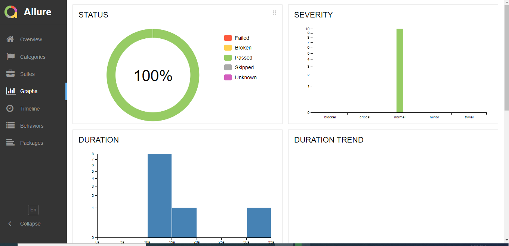
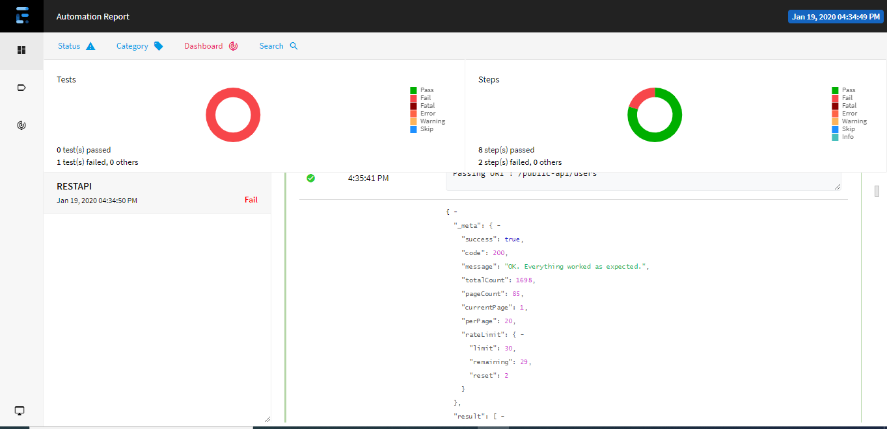

## REST-ASSURED BDD Framwork
[](https://maven-badges.herokuapp.com/maven-central/io.rest-assured/rest-assured)
[](http://www.javadoc.io/doc/io.rest-assured/rest-assured)


Testing and validation of REST services in Java is harder than in dynamic languages 
such as Ruby and Groovy. REST Assured brings the simplicity of using these 
languages into the Java domain.


## Examples
Here's an example of how to make a GET request and validate the JSON response using above Project:

```java
// first hit the service then get the response for the get request
Common_Methods.Get_Instance().hit_service(arg1, Resttype);
Common_Methods.Get_Instance().GET_request();

//Note: All GET,POST,PUT,DELETE resources are called from Excel through Gherkin
```

Using parameters:

```java
given().
    param("key1", "value1").
    param("key2", "value2").
when().
    post("/somewhere").
then().
    body(containsString("OK"));
```

Need to Read JSON File ? Here is the below Solution:

```java
 //Below is sample snippet to Read JSON using GSON
call this method to read JSON file -> ReadJSONFile(String arg1)

```

Need authentication? REST Assured provides several authentication mechanisms:

```java
given().auth().basic(username, password).when().get("/secured").then().statusCode(200);
```

Getting a response body:

```java
// Example for getting Response body using "setResponse_content" Method
setResponse_content(BaseclassInitilizer.response.getBody().asString());   

// Example with setResponse_content and how it is used
public static String getResponse_content() {
		return response_content;
	}

public static void setResponse_content(String response_content) {
		Common_Methods.response_content = response_content;
	}
```

REST Assured supports any HTTP method but has explicit support for *POST*, *GET*, *PUT*, *DELETE*, *OPTIONS*, *PATCH* and *HEAD* and includes specifying and validating e.g. parameters, headers, cookies and body easily.

## Need Reporting ? 
## Allure and Extent Reports Provides you Excellect way of Reporting



## Need to check Mandatory fileds in API?
```java
public void Verify_JSON_Data(String Response,String data)

Response--> Our API JSON Response
data --> The data need to checked weather it is present or not inside JSON.
//The above method present inside the project is used to split JSON and JSON Array weather the Mandatory field is Present or Not and give you report inside Extent reports weather it is pass or Fail.
```
## Need to Test SOAP in Restassured?

```java
Common_Methods.Get_Instance().ReadXMLFile(arg1);

FOR SOAP :
ReadXMLFile--> it is used read the XMLfile and post,
BaseclassInitilizer.httpreq.headers("Content-Type","text/xml");
BaseclassInitilizer.httpreq.body( ReadXMLFile.toString());

```

## Documentation

* [Getting started](http://rest-assured.io/)
* [Javadoc](http://www.javadoc.io/doc/io.rest-assured/rest-assured/4.2.0)
* [Rest Assured Javadoc](http://static.javadoc.io/io.rest-assured/rest-assured/4.2.0/io/restassured/RestAssured.html)

## Support and discussion
Join the mailing list at My [Stackoverflow](https://stackoverflow.com/users/9892120/koushick). 
